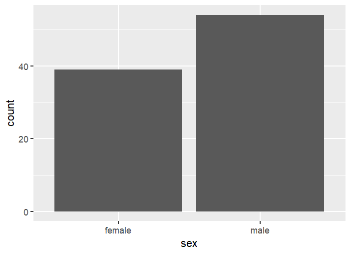
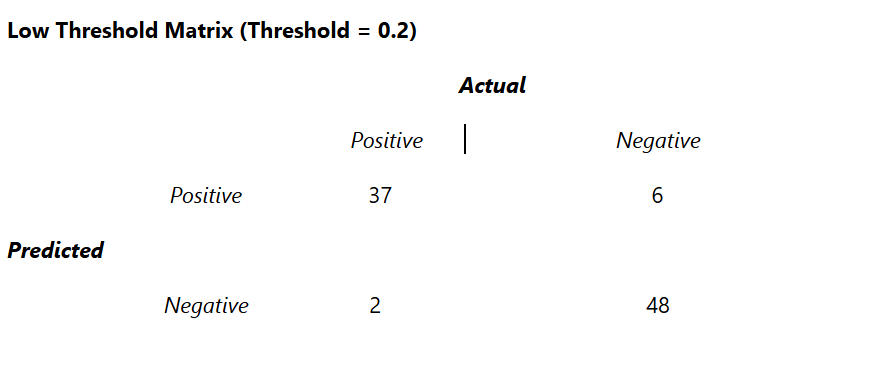
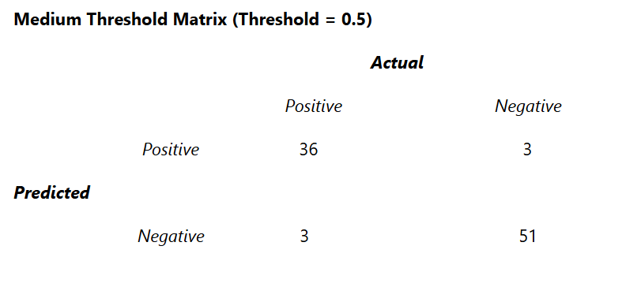
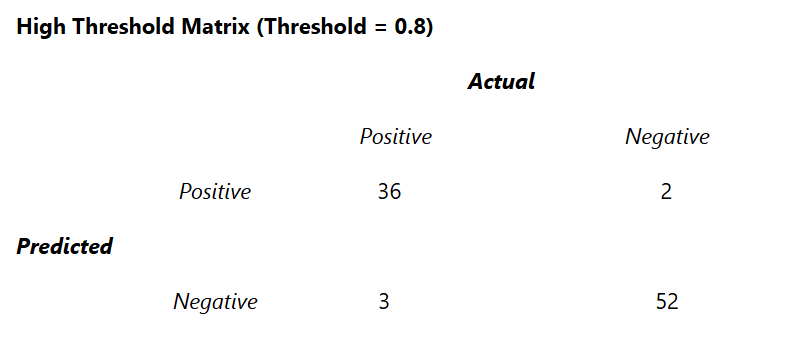

## Introduction

In this assignment, I will be evaluating classification model performance using the penguin_predictions.csv dataset. The dataset contains three columns: pred_female, pred_class, and sex. Pred_female contains the model-predicted probability that the observation belongs to the "female" class, pred_class is the predicted class label, and sex is the actual class label. I will be presenting the null error rate, confusion matrices at multiple thresholds, performance metrics, and threshold use cases. I believe the threshold use cases will be the most difficult section of the project, as it requires more than just calculations. Effective analysis of the calculations is required to understand when a particular threshold is preferable.

## Body

To start, I calculated the null error rate (NER) for this dataset. Determining the null error rate is important because it is effective at evaluating models trained on imbalanced datasets. NER can effectively help identify bias towards the most common classification. NER serves as a good baseline to determine how effective a model is in comparison to a simple guess. For NER, I did all of my calculations using R. First, I loaded the necessary libraries and read the "penguin_predictions.csv" file.

```         
library(tidyverse) penguin_predictions <- read.csv("penguin_predictions.csv")
```

To calculate NER, you must divide the number of minority class samples by the total number of samples in a dataset. It is important to determine in this case, which sex is the minority out of the entire dataset. To visualize this, I created a bar chart:

```         
ggplot(data = penguin_predictions, aes(x = sex)) + geom_bar()
```



***NER = number of females / total number of penguins***

For the calculation, I decided it was best to create two new variables

*total*: represents the total number of penguins

*fm_count*: represents the total number of female penguins

In order to calculate the total, I used this script:

`total <- nrow(penguin_predictions)`

This simply counts the number of rows in our dataset. Since each row represents a different penguin, the total number of rows is our total number of penguins.

Next, I had to calculate the total number of females. I did this by summing up the amount of rows that contained "female" in the column "sex." This code is as follows:

`fm_count <- sum(penguin_predictions$sex == "female", na.rm = TRUE)`

The `na.rm = TRUE` section is included to account for any missing values, which isn't an issue in this dataset, but it is good practice to take missing values into consideration.

Finally, I did a simple calculation to find the NER:

`ner <- fm_count / total`

The NER came out to

```         
 0.4193548
```

For confusion matrices and performance metrics, I performed all of the calculations by hand. To start, I created three confusion matrices based on three different thresholds (0.2, 0.5, and 0.8). For the sake of simplicity, I will be referring to the 0.2 threshold matrix as the "low threshold matrix," the 0.5 matrix as the "medium threshold matrix," and the 0.8 threshold matrix as the "high threshold matrix." I will display each of these matrices here:







The following are the values of True Positives (TP), False Positives (FP), True Negatives (TN), and False Negatives (FN) for each matrix:

**Low Threshold Matrix (Threshold = 0.2)**

TP = 37

FP = 6

FN = 2

TN = 48

**Medium Threshold Matrix (Threshold = 0.5)**

TP = 36

FP = 3

FN = 3

TN = 51

**High Threshold Matrix (Threshold = 0.8)**

TP = 36

FP = 2

FN = 3

TN = 52

**Accuracy**

The accuracy of each matrix can be determined with the following formula:

***Accuracy = (TP +TN) / (TP + FP + FN +TN)***

The accuracy for each matrix is as follows,

**Low Threshold Matrix**

Accuracy = 0.904

**Medium Threshold Matrix**

Accuracy = 0.926

**High Threshold Matrix**

Accuracy = 0.936

**Precision**

The precision of each matrix can be found with the following formula,

***Precision = TP / (TP + FP)***

The precision of each matrix is as follows,

**Low Threshold Matrix**

Precision = 0.860

**Medium Threshold Matrix**

Precision = 0.923

**High Threshold Matrix**

Precision = 0.947

**Recall**

The recall of each matrix can be determined with the following formula,

***Recall = TP / (TP + FN)***

The recall of each matrix is as follows,

**Low Threshold Matrix**

Recall = 0.949

**Medium Threshold Matrix**

Recall = 0.923

**High Threshold Matrix**

Recall = 0.923

**F1 Score**

The F1 score of each matrix can be determined with the following formula,

F1 Score = 2 \* \[ (Precision \* Recall) / (Precision + Recall) \]

The F1 Scores for each matrix are as follows,

**Low Threshold Matrix**

F1 Score = 0.902

**Medium Threshold Matrix**

F1 Score = 0.923

**High Threshold Matrix**

F1 Score = 0.935

**Threshold Use Cases**

An important note to consider when using confusion matrices is the effectiveness of a given threshold depending on the scenario. A low threshold and a high threshold both have their proper use cases scenarios.

A low threshold will predict positive much more often. This increases the true positives, but also drives up the false positives. Thus, low threshold should be used when missing a positive case is incredibly detrimental. For example, a low threshold would be used if we were predicting cancer development. This is because a false positive is much less detrimental than a false negative. A false negative can lead to someone not getting the treatment they need.

On the other hand. high thresholds predict negative much more often. This increases true negative and false negative, and also reduces false positive. Therefore, high thresholds should be used when identifying false positives is much more costly than identifying false negatives. An example would be if a credit card company is predicting fraudulent activity. It is much more costly for them to accidentally freeze someone's credit card than it would be to miss a case of fraud, which could be reported by the card holder when they notice the false charges.

## Conclusion

To conclude, a model can be implemented, tested, and evaluated in many ways depending on the use case. In this assignment, I used one dataset and tested many different ways to evaluate the results of the predictions. A way to build upon this work could be to use numerous predictive models and evaluate them all using these methods to determine which is the most effective, or appropriate for a certain setting.
